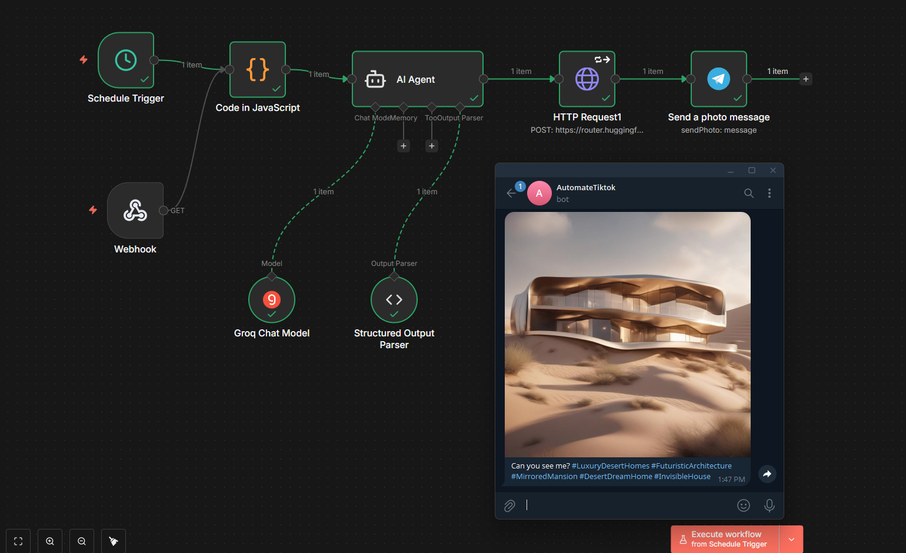

# Automate Image Generating AI Agent 🏗️✨


An autonomous AI Agent built in **n8n** that generates viral "Impossible Architecture" concepts using **Groq** & **Stable Diffusion**, and automatically sends them to **Telegram**.

## 📸 Workflow Overview



## 🚀 Features

*   **🧠 Intelligent Brain (Groq):** Uses `Llama-3.3-70b` to generate creative, non-repetitive architecture concepts (e.g., "A glass house inside a thundercloud" or "A bioluminescent jungle pod").
*   **🎨 High-End Vision (Hugging Face):** Uses **Stable Diffusion XL (SDXL 1.0)** to render 8k, photorealistic architectural visualizations for free.
*   **🔄 Anti-Repetition Logic:** Includes a Randomizer to ensure the bot rotates between environments (Ocean, Desert, Snow, Space, Urban) and never gets stuck on one theme.
*   **🤖 Structured Output:** Forces the AI to return strict JSON with a viral-style question and exactly 5 relevant hashtags.
*   **⏱️ Hybrid Trigger:** Runs automatically on a schedule (e.g., every 6 hours) OR manually via a Telegram command (`again`).

## 🛠️ Prerequisites

To run this workflow, you need:
1.  **n8n** installed locally (via npm or Docker) or hosted on a cloud server.
2.  **Groq API Key** (Free) for the text generation.
3.  **Hugging Face Token** (Free) for the image generation.
4.  **Telegram Bot Token** (from @BotFather) to receive the images.

## 📥 Installation

1.  **Clone this repository** or download the `.json` file.
2.  Open your n8n dashboard.
3.  Click **Add Workflow** -> **Import from File**.
4.  Select the `Automate_Image_Generator.json` file.

## ⚙️ Configuration

For security reasons, the API keys have been removed from the workflow file. You must set them up in n8n Credentials:

### 1. Telegram Credentials
*   Open the **Telegram Trigger** node.
*   Create a new credential using your **Bot Token**.

### 2. Hugging Face (for SDXL)
*   Go to **Credentials** in n8n -> **Header Auth**.
*   Name: `HuggingFace_Flux` (or similar).
*   Name: `Authorization`.
*   Value: `Bearer hf_YOUR_TOKEN_HERE`.
*   *Note: Ensure you assign this credential to the HTTP Request Node.*

### 3. Groq (for Llama 3)
*   Open the **Groq Chat Model** node.
*   Create a new credential and paste your **Groq API Key**.
*   Ensure the model is set to `llama-3.3-70b-versatile`.

## 🧠 How It Works (The Logic)

1.  **Trigger:** The workflow starts via a Timer (Schedule) or a Webhook Trigger (You can trigger the workflow using Webhook URL).
3.  **AI Agent (Groq):** Pick a random environment and generates a detailed image prompt + a viral caption in JSON format.
4.  **Image Gen (HTTP Request):** Sends the prompt to Hugging Face's `stable-diffusion-xl-base-1.0` API.
5.  **Output:** The binary image and the text caption are combined and sent to your Telegram Bot Chat.

## ⚠️ Important Note for Local Users

If you are running n8n on your **local computer (localhost)**:
*   The **Telegram Trigger** will not work unless you expose your local server to the internet.
*   **Fix:** Start n8n using the tunnel command:
    ```bash
    n8n start --tunnel
    ```
*   *Warning:* If you close your terminal or turn off your PC, the automation will stop.

## 🤝 Contributing

Feel free to fork this project and add new nodes (e.g., post to LinkedIn, Instagram, or save prompt history to Google Sheets)!
